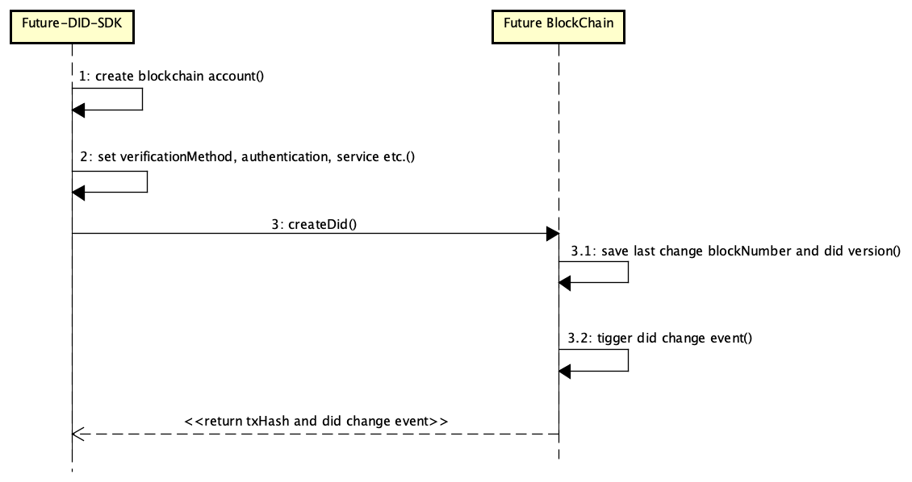
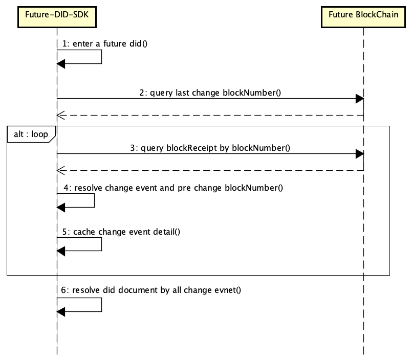
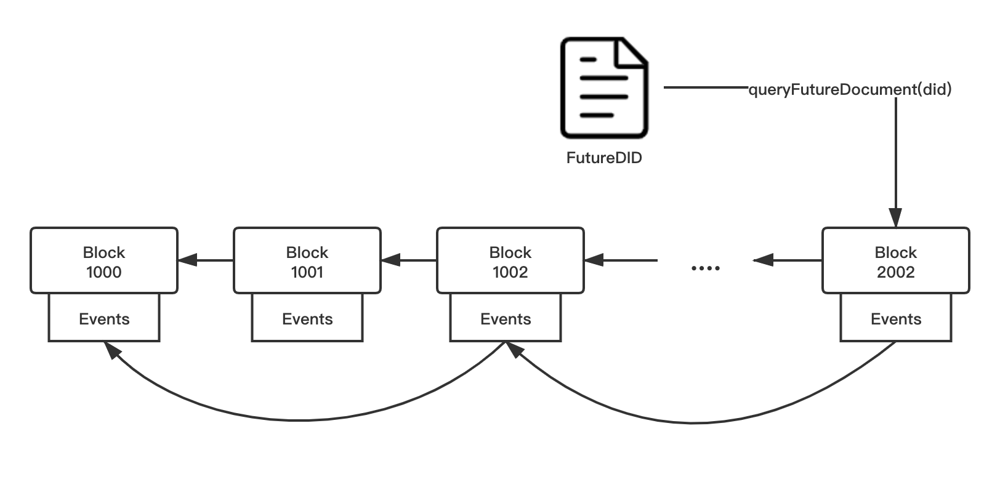
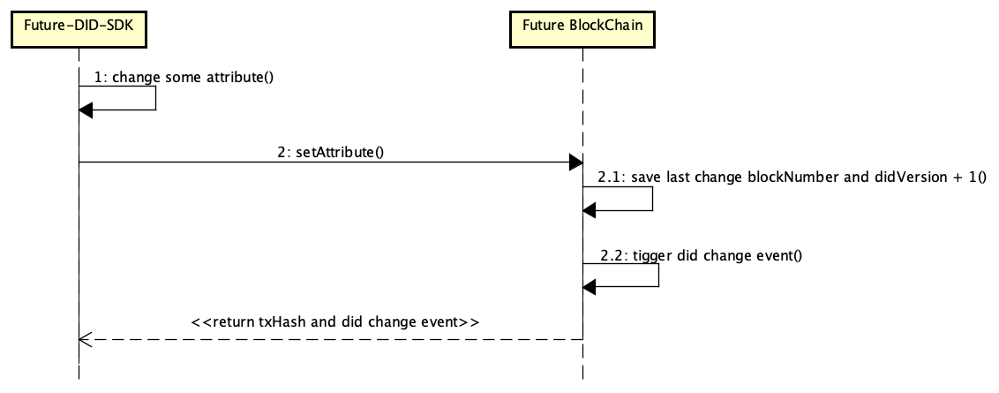
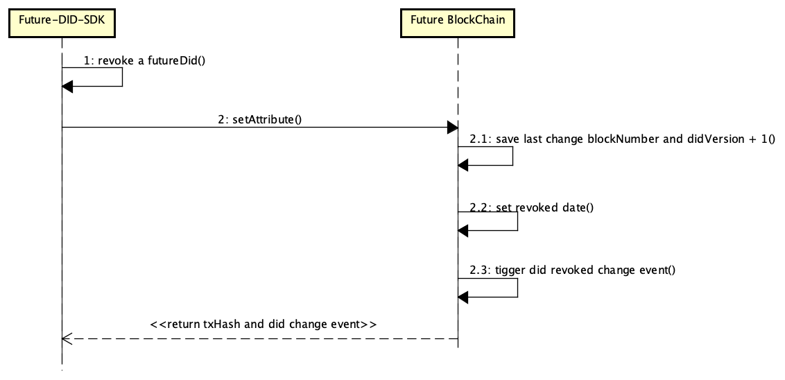

# Future DID Specification

## Version
| Version | Date | Content | Author |
| ---- | ---- | ---- | ---- |
|v0.1	| Dec.10 2020 |	The first submission of FutureDID specification document|	Netease BlockChain Team |

## Introduction
Future DID is the basic platform of individual digital identification and identity certificate based on Blockchain technology and W3C standard(https://w3c.github.io/did-core/) in Netease, supporting the independent creation, use, update and deactivation of users' digital identities in government and enterprise client scenarios.
Based on trusted digital identities, user data scenarios can be accessed and aggregated, so that an autonomous and controllable personal data network can be formed to support third-party applications for data and identity authentication, inquiry, verification, access, etc., to maximize the credibility and compliance of personal data for commercial use.

**Features**
- FutureDID provides distributed decentralized digital identity and trusted data exchange and circulation, which is a new global passport in the future.
- In view of the concept of serving the public and value exchange, FutureDID builds credible infrastructures, committing to promote cross-industrial and cross-functional cooperation, so as to grasp the core of future business value.
- FutureDID uses blockchain to record the relationship between entity data information identification and its corresponding public and private key, to achieve accessibility, and provide verifiable and authorized digital identity basic services, which has realized the data exchange among multiple information systems.

**Current Application scenario**
- NetEase Future Conference 2020
- NetEase Star App

## Future-DID-Method Definition
DID is the decentralization of user’s digital identity, whose format is as follows:
```
did:future:<method-specific-id>
```
Method-specific-id is the blockchain address genderated by the public key hash, whose public and private keys are produced byunderlying blockchain platform. The blockchain address is composed of ('0x' + 40 hexadecimal characters), refering to the Ethereum address generation format.

E.g.
```
did:future:0x64db3dd38333a852d3783f8da5c9f9c15926174c
```
Algorithm support for key generation:
- Secp256k1


## Future-DID-Document Definition
The following are the basic fields of our FutureDID document:
```
{
    "@context":"https://www.w3.org/ns/did/v1",
    "id":"did:future:0x64db3dd38333a852d3783f8da5c9f9c15926174c",
    "version":"2"
    "created":"2020-11-04 15:52:19.698", 
    "updated":"2020-11-04 15:52:19.698", 
    "verificationMethod":[  
        {
            "id":"did:future:0x64db3dd38333a852d3783f8da5c9f9c15926174c#keys-0", 
            "type":"EcdsaSecp256k1VerificationKey2019",
            "publicKeyHex":"69831299193128747476409895200703768919133420816223061693097188765848585"
        }，
        {
            "id":"did:future:0x64db3dd38333a852d3783f8da5c9f9c15926174c#keys-1", 
            "type":"EcdsaSecp256k1VerificationKey2019",
            "publicKeyHex":"02b97c30de767f084ce3080168ee293053ba33b235d7116a3263d29f1450936b71"
        }
    ],
    "authentication":[
            "did:future:0x64db3dd38333a852d3783f8da5c9f9c15926174c#keys-0", 
            "did:future:0x64db3dd38333a852d3783f8da5c9f9c15926174c#keys-1", 
    ],
    "service":[
        {
            "id":"did:future:0x009b7ccba04c642801bb6731972ea47ec12c74cd", 
            "type":"didBlockchainService", 
            "serviceEndpoint":"https://blockchain.163.com/futuredid" 
        }
    ]
}
```

Among them:

- id: the subject number value of DID entity
- version: the version of DID document 
- created: the creation time of DID document 
- updated: the modification of DID document
- verificationMethod: the list of DID public key
- authentication: demonstrating that the user who owns the private key corresponding to the specific public key is exactly the owner of this DID entity, specified by <DID>#keys-(n)
- service: some service endpoints associated with the topic of the current DID, such as the address of FutureDID blockchain service

## Operations
### Creation
The creation process is as follows:

- Step1: A unique blockchain address account on the entire network can be generated by Future-DID-SDK, based on the blockchain account generation rules.
- Step2: Based on the blockchain address, FutureDID can be set with parameters like verificationMethod, authentication, and service.
- Step3: Enter each parameter and create FutureDID on the blockchain: it records the latest-modified block number as well as the latest version of current DID; it triggers FutureDID modification events which consists DID, event number, event details, modification time, and latest-modified block number.
- Step4: Return transaction hash and modification events on the blockchain, and then complete FutureDID creation.



**FutureDID underlying storage and reading instructions:**

On account of the constantly iterating and updating needs of FutureDID：
- If the smart contract stores all the ins and outs, plenty of historical data will be generated at updates.
- If FutureDID contract needs to be generalized, it is not realistic to design a large and complete mapping table.

Meanwhile, the expression of smart contracts is not strong enough, so FutureDID uses Linked Event, the smart contract storage method based on event chain.


### Read
The reading process is as follows:

- Step1: Enter a FutureDID.
- Step2: Query the latest-modefied block number of FutureDID on the blockchain.
- Step3: Query transaction receipt through block number.
- Step4: Analyze the detailed information and the block number of previous modification through the transaction receipt, and cache them.
- Step5: Query transaction receipt through the previous block number again, and then repeat Step4 until the block number is zero.
- Step6: Restore the details of the DID document through all the information of modifications in the cache.



**The specific process of Smart contract storage method based on event chain is as follows:**

- Record the current block height corresponding to the update event, which is recorded whenever a property modification of the DID document is triggered.
- Modification will eventually be stored in the blockchain's receipt event.
- While reading the DID document, combine and restore related document with all the receipt event that queried through the lastest block height information, which is read through block data mapping.




### Modification
The change process is as follows:

- Step1: FutureDID holders can change any parameters, including verificationMethod, authentication, and service.
- Step2: The FutureDID holder calls the "setAttribute()" method of DID contract.
- Step3: The block number and version of the latest modification of current DID will be recorded on blockchain, and the FutureDID modification event will be triggered.
- Step4: The modification of FutureDID will be completed after returning transaction hash and the modification events on the blockchain.




### Revocation
Revocation means that the existing DID is invalid.

The process of setting revocation of the invalid DID is as follows:

- Step1: FutureDID holders are able to revoke their DID.
- Step2: FutureDID holders need to use the "setAttribute()" method of DID contract in order to revoke their DID.
- Step3: Blockchain will record the block number and version of the latest modification of current DID. Set up the revocation time and the trigger event of revocation.
- Step4: The revocation of FutureDID will be completed after returning transaction hash and the corresponding event on the blockchain.



## Security Considerations
- The owners of a FutureDID account ought to remember and save any related keys of their current DID (e.g. private key, mnemonic, passward of cryptocurrency wallet) locally. Losing those keys or making them public to other parties means losing control of their own DID.
- The underlying technology of FutureDID can be used to suppport the alliance chain built by Netease BlockChain, with better node access, privacy protection capabilities, and alliance security.


## Privacy Considerations
- The private key which can prove the ownership of current FutureDID only exists on its user's device, so as not to be known to any third party.
- The privacy-related information of FutureDID holders will be stored on the side of the issuing party (the authority) instead of being stored on the blockchain. These privacy attributes can be proved by statements issued by the authority, so as not to be leaked.
- FutureDID can use private key signature technology to avoid malicious tampering of document.
- FutureDID can use private key signature technology to prevent malicious tampering of DID document.

## References
[ECDSA Secp256k1 Signature 2019](https://w3c-ccg.github.io/lds-ecdsa-secp256k1-2019/). O. Steele. W3C. April 2019